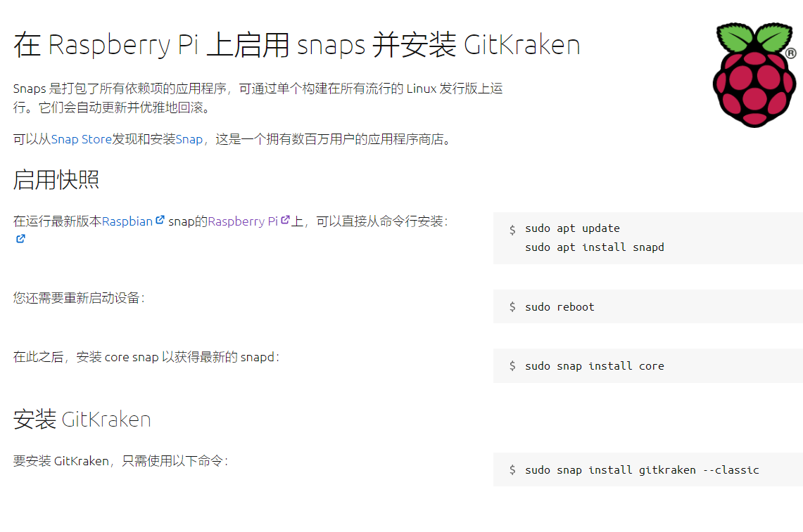

# 树莓派4b调试记录

## 账号密码

pi:123qwe

rood:123qwe

## cmd命令

#### 更新软件版本以及版本列表

`sudo apt update`

#### 更新系统版本

`sudo apt upgrade`

#### 解压到 `Downloade`文件夹

`unzip code.zip -d Downloade`

#### 压缩到 `Downloade`文件夹

`zip -r code.zip Downloade `

#### 安装gitkraken

在运行最新版本Raspbian snap的[Raspberry Pi](https://www.raspberrypi.org/)上，可以直接从命令行安装：

`sudo apt update `

`sudo apt install snapd`

您还需要重新启动设备：

`sudo reboot`

在此之后，安装 core snap 以获得最新的 snapd:

`sudo snap install core`

要安装 GitKraken，只需使用以下命令：

`sudo snap install gitkraken --classic`

