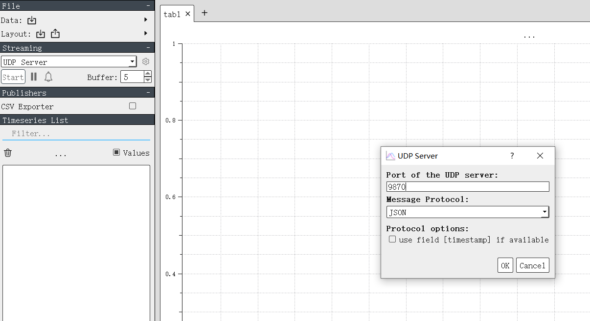
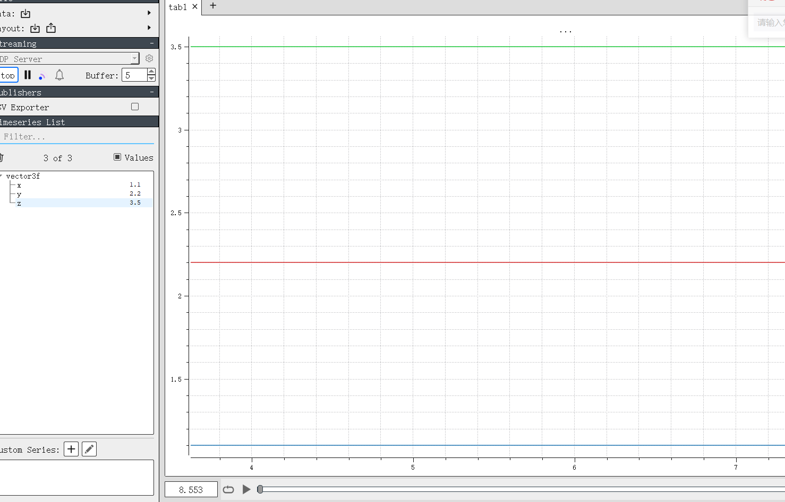

# 串口打印及显示到plotjuggler

## 协议

 `# |header(0xaa) | id(u16) | payload len(u16) | payload | tailer(0x55) |`

## 代码

```
#!/usr/bin/python3
# coding:utf-8

from binascii import b2a_hex
from struct import pack, unpack, calcsize
import json
from serial import Serial
import argparse
from socket import socket, AF_INET, SOCK_DGRAM

# |header(0xaa) | id(u16) | payload len(u16) | payload | tailer(0x55) |
if __name__ == "__main__":
    parser = argparse.ArgumentParser(description="serial2json program")
    parser.add_argument("-p", "--port", help="set serial port")
    parser.add_argument("-b", "--baudrate", help="set serial baudrate")
    args = parser.parse_args()
    ip_addr = ("127.0.0.1", 9870)
    # "127.0.0.1"
    #  回送地址：127.0.0.1。一般用于测试使用。例如：ping 127.0.0.1 来测试本机TCP/IP是否正常。
    # 
    s = socket(AF_INET, SOCK_DGRAM)
    ser = Serial(args.port, baudrate=args.baudrate, timeout=3)
    f = open("packet_descript.json", "r")
    desc = json.load(f)
    f.close()
    data = desc["msgs"][0]["members"]
    print(data)

    while True:
        header = ser.read(1)
        if header == b'\xaa':
            id_raw = ser.read(2)
            if len(id_raw) != 2:
                continue
            payload_len_raw = ser.read(2)
            if len(payload_len_raw) != 2:
                continue
            payload_len = unpack("<H", payload_len_raw)[0]
            payload_raw = ser.read(payload_len)
            if len(payload_raw) != payload_len:
                continue
            tailer = ser.read(1)
            if tailer != b'\x55':
                continue
            id = unpack("<H", id_raw)[0]
            members_desc = [{"name": x["name"], "pack_format":x["pack_format"],
                             "members":x["members"]} for x in desc["msgs"] if x["id"] == id]
            if len(members_desc) < 1:
                continue
            member_desc = members_desc[0]
            keys = member_desc["members"].keys()
            if calcsize(member_desc["pack_format"]) == payload_len:
                data = unpack(member_desc["pack_format"], payload_raw)
                # print(data[0])
                # print(data[1])
                # print(data[2])
                data_json = {member_desc["name"]: dict(zip(keys, data))}
                str_json = json.dumps(data_json)
                print(str_json)
                s.sendto(str_json.encode("utf-8"), ip_addr)

```

## 输入操作

`python .\seial2json_xyz.py -p COM11 -b 115200`

## PlotJuggler




